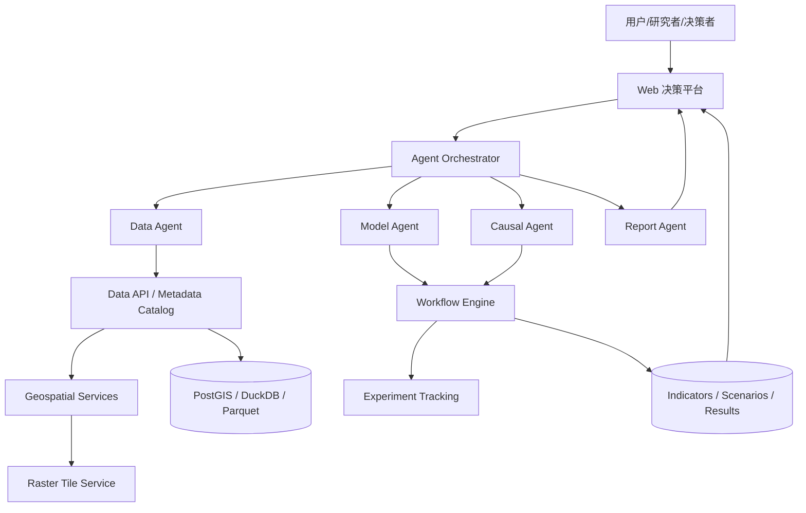

# AirMosaic AI 相关开源项目方法调研

日期：2026-07-02  
项目：AirMosaic AI（清空智枢：大气环境决策智能分析平台）  
目标：学习可用于“Agent 数据获取、模型设计、因果推断集成、大气环境决策”的开源项目架构方法。

## 执行摘要

AirMosaic AI 不宜只做一个传统可视化网站，更适合设计成“Agent 编排层 + 数据服务层 + 模型服务层 + 因果推断层 + 决策前端”的分层平台。LangGraph、AutoGen、LlamaIndex 提供 Agent 和数据检索模式；DoWhy、EconML 提供因果推断工作流；pygeoapi、tiTiler 提供地理空间数据服务模式；Prefect、MLflow 提供工作流和实验治理能力。

## 参考项目与可借鉴点

| 方向 | 项目 | 关键方法 | 对 AirMosaic AI 的启发 |
|---|---|---|---|
| Agent 编排 | LangGraph | 状态图、可恢复 Agent、人机协同、多 Agent 示例 [citation:LangGraph GitHub](https://github.com/langchain-ai/langgraph) | 用图结构表达“问题理解 -> 数据获取 -> 建模 -> 因果分析 -> 报告生成” |
| 多 Agent 协作 | AutoGen | Agentic AI 编程框架、多 Agent 对话/协作 [citation:AutoGen GitHub](https://github.com/microsoft/autogen) | 设计数据 Agent、模型 Agent、因果 Agent、报告 Agent |
| 数据/RAG | LlamaIndex | 文档 Agent、OCR、RAG、数据连接器 [citation:LlamaIndex GitHub](https://github.com/run-llama/llama_index) | 连接论文、政策文本、统计年鉴、代码、元数据和本地数据目录 |
| 因果推断 | DoWhy | 显式建模假设、识别、估计、反驳检验 [citation:DoWhy GitHub](https://github.com/py-why/dowhy) | 将因果分析做成可解释流程，而不是黑箱回归 |
| 异质性效应 | EconML | Double ML、处理效应估计、经济决策场景 [citation:EconML GitHub](https://github.com/py-why/EconML) | 做政策情景、污染暴露、健康影响和经济结果的异质性效应分析 |
| 地理 API | pygeoapi | OGC API、OpenAPI、GeoJSON、HTML [citation:pygeoapi GitHub](https://github.com/geopython/pygeoapi) | 对外提供标准化区域、网格、指标、时间序列 API |
| 栅格瓦片 | tiTiler | FastAPI、COG/STAC、动态栅格瓦片 [citation:tiTiler GitHub](https://github.com/developmentseed/titiler) | 服务 PM2.5、NO2、TAP、遥感栅格和情景图层 |
| 工作流编排 | Prefect | Python 数据流水线、任务/流程、观测性 [citation:Prefect GitHub](https://github.com/PrefectHQ/prefect) | 定时下载、清洗、聚合、指标计算、模型运行 |
| 模型治理 | MLflow | 模型、Agent、LLM 调试、评估、监控 [citation:MLflow GitHub](https://github.com/mlflow/mlflow) | 记录模型版本、参数、结果、Agent 运行轨迹和评估指标 |

## 推荐平台架构



## AirMosaic AI 的 Agent 划分

1. **Coordinator Agent**
   - 负责理解用户问题、拆解任务、选择工具和调度其他 Agent。
   - 借鉴 LangGraph 的状态图模式，把任务状态显式化。

2. **Data Agent**
   - 负责从 TAP、MEIC、人口、GDP、健康、遥感、统计年鉴等数据源中定位数据。
   - 应维护数据目录、变量解释、空间分辨率、时间范围和许可信息。

3. **Model Agent**
   - 负责建议或运行暴露评估、健康负担、经济影响、不平等指标、预测模型。
   - 需要与工作流系统绑定，避免 Agent 直接随意运行不可追踪脚本。

4. **Causal Agent**
   - 负责把“政策/污染变化是否导致健康或经济结果变化”转成因果问题。
   - 流程应包括：因果图假设、识别策略、估计方法、稳健性/反驳检验。

5. **Report Agent**
   - 负责把数据、图表、因果结论和不确定性说明组织成研究报告或政策简报。

## 数据与模型层建议

### 数据层

建议使用三类存储：

- **文件湖**：保留原始数据，例如 TAP、NetCDF、CSV、GeoTIFF、RDS。
- **分析表**：用 Parquet/DuckDB 管理清洗后的面板数据、网格数据、区域汇总指标。
- **空间库**：用 PostGIS 管理行政区、网格、缓冲区、暴露匹配结果。

### 服务层

- 向前端和 Agent 暴露统一 API，而不是让 Agent 直接读散落文件。
- 栅格地图可借鉴 tiTiler 的动态瓦片服务模式。
- 矢量/指标接口可借鉴 pygeoapi 的 OGC API 和 OpenAPI 思路。

### 模型层

模型不应只是脚本集合，建议包装为：

- `ExposureModel`
- `HealthBurdenModel`
- `EconomicImpactModel`
- `InequalityModel`
- `CausalEffectModel`

每个模型都应定义输入、输出、参数、版本、运行日志和可复现实验记录。

## 因果推断集成方式

AirMosaic AI 的因果模块可以按 DoWhy/EconML 思路设计为四步：

1. **建模问题**
   - treatment：政策、污染削减、能源结构变化、交通干预等。
   - outcome：死亡率、健康负担、GDP、收入、不平等、医疗支出等。
   - confounders：人口、气象、产业结构、基线污染、城市化、政策共变项。

2. **识别策略**
   - DID、event study、IV、synthetic control、matching、panel fixed effects。

3. **估计效应**
   - 传统计量模型用于主分析。
   - Double ML、causal forest 用于异质性效应和高维控制。

4. **反驳与稳健性**
   - placebo treatment。
   - placebo outcome。
   - 随机共同原因。
   - 不同空间尺度和时间窗口敏感性。

## 第一版应优先学习并复用的模式

推荐优先级：

1. **LangGraph 式 Agent 状态图** [citation:LangGraph GitHub](https://github.com/langchain-ai/langgraph)
   - 原因：平台核心是“可解释、可恢复、可审计”的 Agent 工作流。

2. **LlamaIndex 式数据/文档连接器** [citation:LlamaIndex GitHub](https://github.com/run-llama/llama_index)
   - 原因：你已有大量本地数据、R 脚本、年鉴、论文和说明文档，需要统一检索。

3. **DoWhy 式因果工作流** [citation:DoWhy GitHub](https://github.com/py-why/dowhy)
   - 原因：平台若要用于决策，必须明确假设、识别、估计和反驳，而不是只输出相关性。

4. **pygeoapi/tiTiler 式空间服务** [citation:pygeoapi GitHub](https://github.com/geopython/pygeoapi) [citation:tiTiler GitHub](https://github.com/developmentseed/titiler)
   - 原因：大气环境平台必须把网格、行政区、栅格和地图服务标准化。

5. **Prefect + MLflow 式运行治理** [citation:Prefect GitHub](https://github.com/PrefectHQ/prefect) [citation:MLflow GitHub](https://github.com/mlflow/mlflow)
   - 原因：Agent 触发的数据处理和模型运行必须可追踪、可复现、可回滚。

## 建议的工程模块边界

```text
AirMosaicAI/
  apps/
    web/                 # 网站前端
    api/                 # FastAPI / 数据与模型接口
  packages/
    agents/              # Coordinator、Data、Model、Causal、Report agents
    data_catalog/         # 数据目录、元数据、路径索引
    geospatial/           # 空间匹配、瓦片、区域聚合
    models/               # 暴露、健康、经济、不平等模型
    causal/               # DID、IV、DML、反驳检验
    workflows/            # 下载、清洗、建模流水线
  data/
    raw/                  # 原始数据引用或软链接，不建议直接提交
    processed/            # 清洗后样例或轻量数据
  docs/
    research/             # 调研报告
    specs/                # 设计文档
```

## 对网站第一版的启发

网站不建议先做纯宣传首页。第一屏应该直接展示平台能力：

- 左侧：AI Agent 查询入口。
- 中部：地图和指标看板。
- 右侧：分析任务状态、数据来源、模型假设和因果识别摘要。

第一版可实现为静态/半动态原型，重点把“Agent 如何接入数据、模型、因果推断”的交互逻辑讲清楚。

## 资料来源

- LangGraph GitHub：`langchain-ai/langgraph`，描述为 “Build resilient agents.”，截至 2026-07-02 约 36k stars [citation:LangGraph GitHub](https://github.com/langchain-ai/langgraph)。
- AutoGen GitHub：`microsoft/autogen`，描述为 “A programming framework for agentic AI”，截至 2026-07-02 约 59k stars [citation:AutoGen GitHub](https://github.com/microsoft/autogen)。
- LlamaIndex GitHub：`run-llama/llama_index`，描述为 “document agent and OCR platform”，截至 2026-07-02 约 50k stars [citation:LlamaIndex GitHub](https://github.com/run-llama/llama_index)。
- DoWhy GitHub：`py-why/dowhy`，强调显式建模和测试因果假设，截至 2026-07-02 约 8k stars [citation:DoWhy GitHub](https://github.com/py-why/dowhy)。
- EconML GitHub：`py-why/EconML`，强调机器学习与计量经济学结合的处理效应估计，截至 2026-07-02 约 4.7k stars [citation:EconML GitHub](https://github.com/py-why/EconML)。
- pygeoapi GitHub：`geopython/pygeoapi`，Python OGC API server implementation [citation:pygeoapi GitHub](https://github.com/geopython/pygeoapi)。
- tiTiler GitHub：`developmentseed/titiler`，动态 raster tile services [citation:tiTiler GitHub](https://github.com/developmentseed/titiler)。
- Prefect GitHub：`PrefectHQ/prefect`，Python workflow orchestration [citation:Prefect GitHub](https://github.com/PrefectHQ/prefect)。
- MLflow GitHub：`mlflow/mlflow`，AI engineering platform for agents, LLMs, and ML models [citation:MLflow GitHub](https://github.com/mlflow/mlflow)。

## 初步结论

AirMosaic AI 应定位为“面向大气环境决策的 Agentic Data + Causal Intelligence Platform”。核心差异化不在于单个地图或单个模型，而在于把多源大气数据、社会经济数据、模型脚本、因果识别和报告生成统一进可审计的 Agent 工作流。
