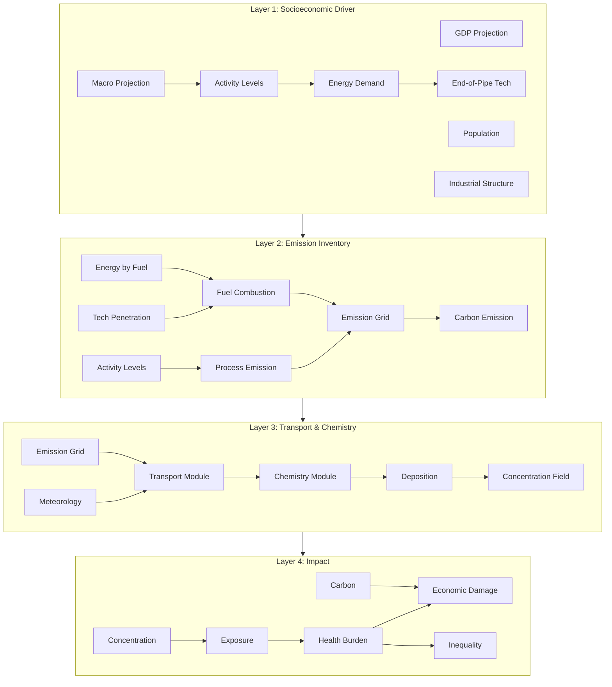

# Workflow I/O Contract and Causal Traceability

How each workflow layer's inputs/outputs connect, and how causal effects propagate through the pipeline for auditability.

---

## 1. Data Flow Across Layers



## 2. Layer I/O Contract

### Layer 1 → Layer 2

| Output (L1) | Type | Unit | Input (L2) |
|-------------|------|------|------------|
| `sector_activity_level` | timeseries | tonnes / vkm | `sector_activity_level` |
| `energy_by_fuel` | timeseries | EJ / 10^4 tce | `energy_by_fuel` |
| `technology_penetration_rate` | timeseries | fraction | `technology_penetration_rate` |

**Contract**: Layer 1 outputs MUST include province-level disaggregation for all 31 China provinces. Annual temporal resolution. Missing province values → workflow halts with error.

### Layer 2 → Layer 3

| Output (L2) | Type | Unit | Input (L3) |
|-------------|------|------|------------|
| `emission_grid` | raster | tonnes/grid/year | `emission_grid` |
| `carbon_emission` | table | tonnes CO2/year | (passes to L4) |

**Contract**: Emission grid MUST be on a consistent 1km or 0.1° grid. Temporal profiles (hourly/daily factors) MUST accompany annual totals. Missing temporal profiles → use default profiles with warning.

### Layer 3 → Layer 4

| Output (L3) | Type | Unit | Input (L4) |
|-------------|------|------|------------|
| `concentration_field` | gridded timeseries | μg/m3 | `concentration_field` |
| `deposition_flux` | gridded timeseries | kg/ha/year | (optional) |
| `process_contributions` | table | fraction | (diagnostic) |

**Contract**: Concentration MUST be validated against monitoring data before passing to Layer 4. R² < 0.5 → flag as low-confidence, use model ensemble or monitoring data directly.

## 3. Causal Traceability Framework

Each result value in the pipeline MUST be traceable to:

1. **Input data source** — which dataset, what vintage, what resolution
2. **Method choice** — AI module vs empirical formula, and why
3. **Intermediate values** — all transformations between raw input and final output
4. **Assumptions** — explicit listing of all modeling assumptions

### Traceability Record Schema

```yaml
trace_record:
  output_id: "attributable_deaths_PM25_Beijing_2030"
  output_value: 1234.5
  output_unit: "deaths/year"
  chain:
    - step: 1
      module: "exposure_assessment"
      method: "grid_average"
      method_reason: "data_volume_below_threshold: grid_cells=340, timesteps=365, total=124100 < 10^6"
      input: "concentration_field"
      input_source: "layer_03.output"
      input_hash: "sha256:abc123..."
      output: "personal_exposure_grid"
      assumptions:
        - "Indoor/outdoor ratio = 1.0 (no indoor data available)"
        - "Population static within year (no migration data)"

    - step: 2
      module: "health_burden"
      method: "ier_gbd"
      method_reason: "data_volume_below_threshold; no individual-level confounders"
      input: "personal_exposure_grid"
      input_hash: "sha256:def456..."
      output: "attributable_deaths_PM25_Beijing_2030"
      parameters:
        ier_alpha: 1.2
        ier_beta: 0.05
        ier_gamma: 0.5
        baseline_mortality_source: "GBD 2019, cause=stroke, age=25+"
        baseline_mortality_hash: "sha256:ghi789..."
      assumptions:
        - "IER parameters from GBD 2019 (may not reflect local exposure-response)"
        - "No effect modification by age beyond baseline rate"
        - "Linear no-threshold at low concentrations"
      counterfactual: "concentration_field from baseline scenario (no policy)"
      counterfactual_hash: "sha256:jkl012..."
```

### How This Enables Causal Audit

| Question | Answered By |
|----------|------------|
| Why was the AI method not used? | `method_reason` field |
| What data produced this result? | `input_source` + `input_hash` |
| What if we used a different baseline mortality rate? | `parameters.baseline_mortality_source` allows substitution |
| Is the result sensitive to the IER shape? | `assumptions` flags parametric uncertainty |
| Can we reproduce this exact number? | Full hash chain: inputs → method → parameters → output |

## 4. Method Selection Branching Logic

```
For each module:
  if total_data_volume > threshold:
    use high_data_method (AI/Transformer)
  else:
    use low_data_method (empirical/expert)

where total_data_volume = spatial_cells × temporal_steps × variables

Thresholds:
  Layer 1 (Macro Projection): 1000 observations
  Layer 2 (Emission): 500 observations or MEIC training data available
  Layer 3 (Transport): 10^6 grid-cell-timesteps
  Layer 4 (Health): 5000 person-year observations with confounders
```

When switching between methods, the traceability record MUST note:
- Which method was used
- Why the other was not
- Expected directional bias from method choice

## 5. Counterfactual Baseline

Every Layer 4 output MUST compare against a counterfactual:

```
Effect = Outcome(policy_scenario) - Outcome(baseline_scenario)
```

The baseline scenario is defined by:
- Layer 1: No additional policy (SSP baseline)
- Layer 2: Frozen emission factors at base year
- Layer 3: Same meteorology, baseline emissions
- Layer 4: Baseline concentration × same population

The counterfactual input hash is stored alongside the policy scenario hash in the trace record, enabling exact reproduction of the estimated causal effect.

## 6. Agent Integration

External agents query workflow results via:

```
get_workflow_output(workflow_run_id, layer_id, output_id)
  → {value, unit, trace_record, counterfactual_value}

audit_trace(workflow_run_id, output_id)
  → full trace chain with hash verification

compare_methods(workflow_run_id, module_id)
  → [high_data_method_result, low_data_method_result, difference, reason_used]
```

The trace record enables an external causal agent to:
1. Verify that confounders were properly adjusted
2. Check that identification assumptions hold
3. Test sensitivity to parametric choices
4. Recompute with alternative methods without re-running full pipeline
